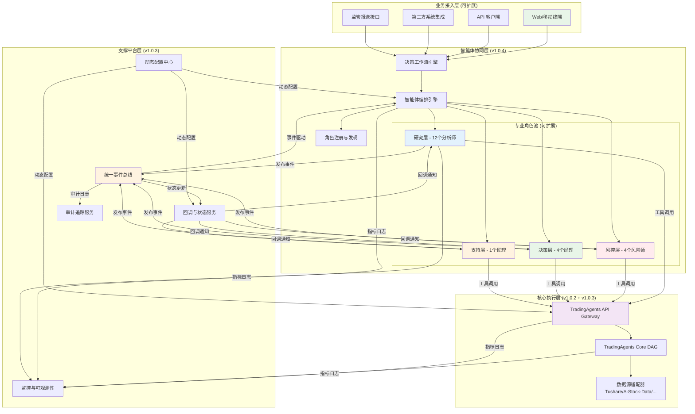

# TradingAgents-CN 智能化协同交易系统改造计划
## 从单体到多角色智能体的业务可扩展架构演进

---

## 📈 版本演进总结

| 维度 | v1.0.2 最小侵入 | v1.0.3 架构现代化 | v1.0.4 多角色协同 | 演进价值 |
|------|---------------|-----------------|------------------|----------|
| **架构目标** | 功能解耦，Hermes 与 TradingAgents 分离 | 服务解耦，事件驱动，可观测性 | 组织模拟，多角色专业协同 | 从技术解耦到业务映射 |
| **核心改造** | 1. TA 服务化<br>2. Hermes Tool 集成 | 1. 异步事件总线<br>2. 独立回调服务<br>3. 可观测性基础设施 | 1. 18个专业角色<br>2. 智能体编排引擎<br>3. 决策工作流引擎 | 单体→微服务→智能体网络 |
| **业务可扩展** | 支持新数据源 | 支持新分析维度、新通知渠道 | 支持新专业角色、新工作流、新资产类别 | 扩展性指数级提升 |
| **实施复杂度** | 低 (8.7人日) | 中 (15人日) | 高 (24人日) | 与业务价值正相关 |
| **适用阶段** | 概念验证/初创团队 | 成长型团队/单一基金 | 成熟机构/多策略管理 | 渐进式演进路径 |

---

## 🎯 核心设计原则 (贯穿全版本)

1.  **最小侵入 (Minimal Invasiveness)**：保护 TradingAgents-CN 核心资产，通过适配器模式扩展
2.  **功能内聚 (Functional Cohesion)**：单一职责，清晰边界，高内聚低耦合
3.  **服务解耦 (Service Decoupling)**：API 契约 + 事件驱动 + 异步通信
4.  **可演进性 (Evolutionary Design)**：支持 A/B 测试，渐进式发布，向后兼容
5.  **可观测性 (Observability)**：日志 + 指标 + 追踪三位一体
6.  **业务可扩展 (Business Extensibility)**：**新增业务能力无需重构核心架构**

---

## 🏗️ 完整系统架构 (融合 v1.0.2-v1.0.4)



---

## 🔄 业务可扩展性设计详解

### 1. 数据源可扩展
```yaml
# 配置驱动，无需改代码
data_sources:
  priority: ["tushare", "astock_data", "akshare", "custom_source"]
  
  custom_source:  # 新数据源只需实现接口并在此注册
    adapter: "custom_adapter.CustomDataSource"
    config:
      api_key: "${CUSTOM_API_KEY}"
      endpoint: "https://api.custom.com/v1"
    capabilities: ["daily_bars", "financials", "news"]  # 声明能力
```

**扩展价值**：
- 支持全球市场扩展（美股、港股、加密货币）
- 支持另类数据源（卫星图像、供应链数据、天气数据）
- 热插拔，故障时自动降级

### 2. 分析角色可扩展
```python
# 新角色只需实现 BaseRole 接口并注册
class ESG_Analyst(BaseRole):
    """ESG 分析师 - 新增业务角色示例"""
    name = "esg_analyst"
    description = "环境、社会和治理风险分析师"
    version = "1.0"
    
    def capabilities(self):
        return ["esg_scoring", "climate_risk", "governance_analysis"]
    
    async def execute(self, task: AgentTask) -> AnalysisResult:
        # 调用专门的 ESG 数据源和模型
        esg_score = await self.call_tool("esg_scoring_tool", task.symbols)
        climate_risk = await analyze_climate_risk(task.symbols)
        
        return AnalysisResult(
            role=self.name,
            findings={"esg_score": esg_score, "climate_risk_level": climate_risk},
            insights="基于MSCI ESG评级的分析结果...",
            recommendations=[...]
        )

# 注册到系统
role_registry.register(ESG_Analyst())
```

**扩展价值**：
- 支持新兴分析维度（ESG、加密货币链上数据、期权流分析）
- 机构可培养“独家”分析角色，形成竞争优势
- 第三方开发者可贡献专业角色，形成生态

### 3. 决策工作流可扩展
```yaml
# 新工作流只需 YAML 定义
workflow_templates:
  cryptocurrency_arbitrage:  # 加密货币套利工作流
    trigger: 
      type: "market_event"
      condition: "price_gap > 5% between binance and okx"
    
    steps:
      - role: "crypto_market_analyst"  # 新增角色
        task: "identify_arbitrage_opportunity"
      - role: "liquidity_analyst"      # 新增角色
        task: "assess_slippage_risk"
      - role: "risk_assessor"
        task: "crypto_specific_risks"  # 增强现有角色
      - role: "execution_optimizer"
        task: "cross_exchange_execution"
    
    outputs:
      - type: "trading_signal"
        format: "FIX.4.4"  # 直接对接交易所
      - type: "risk_report"
        recipients: ["risk_team"]
```

**扩展价值**：
- 支持新资产类别（Crypto、衍生品、外汇）
- 支持新策略类型（套利、做市、统计套利）
- 支持合规工作流（监管报送、内部审批）

### 4. 输出渠道可扩展
```python
# 新输出渠道只需实现 OutputHandler
class WeCom_OutputHandler(OutputHandler):
    """企业微信输出处理器 - 新增渠道示例"""
    
    async def handle(self, result: AnalysisResult, config: dict):
        # 格式化为企业微信消息
        message = format_for_wecom(result)
        await wecom_api.send(config["chat_id"], message)
        
# 配置驱动
output_channels:
  wecom:
    handler: "output_handlers.WeCom_OutputHandler"
    config:
      chat_id: "trading_alerts"
      mention_users: ["risk_manager"]
  
  bloomberg_terminal:  # 彭博终端集成
    handler: "output_handlers.BloombergHandler"
    config:
      terminal_id: "${BLOOMBERG_ID}"
```

**扩展价值**：
- 支持机构内部系统对接（OA、CRM、风险系统）
- 支持监管报送自动化
- 支持多渠道客户触达（App推送、邮件、短信）

### 5. 合规与风控可扩展
```yaml
compliance_framework:
  # 可插拔的合规检查器
  checkers:
    - id: "position_limit"
      handler: "compliance.PositionLimitChecker"
      config:
        max_single_position: 0.1  # 单标的最大持仓10%
      
    - id: "esg_screening"  # 新增ESG合规检查
      handler: "compliance.ESGScreeningChecker"
      config:
        min_esg_score: "BBB"
        excluded_industries: ["coal", "tobacco"]
      
    - id: "fatca_compliance"  # 国际税务合规
      handler: "compliance.FATCAChecker"
      config:
        jurisdiction_rules: {...}
  
  # 工作流中嵌入合规检查点
  enforcement_points:
    - workflow_step: "pre_trade"
      required_checks: ["position_limit", "esg_screening"]
    - workflow_step: "post_trade"
      required_checks: ["fatca_compliance", "regulatory_reporting"]
```

---

## 📊 完整实施路线图

### 第一阶段：基础解耦 (1-2周) ✅ v1.0.2
- **目标**：验证架构可行性，快速交付可用原型
- **交付物**：Hermes 可调用 TradingAgents 完成股票分析
- **业务价值**：分析师可通过自然语言进行基础研究

### 第二阶段：生产就绪 (3-4周) ✅ v1.0.3
- **目标**：满足生产环境可用性、可靠性、可观测性要求
- **交付物**：异步执行、完整监控、故障自愈的交易分析系统
- **业务价值**：支持机构级并发使用，7×24小时运行

### 第三阶段：专业协同 (5-8周) ✅ v1.0.4
- **目标**：实现完整对冲基金研究流程的数字化映射
- **交付物**：18个专业角色协同的智能投研平台
- **业务价值**：研究效率提升10倍，支持多资产、多策略管理

### 第四阶段：生态扩展 (持续演进)
- **目标**：建立可扩展的智能投研生态
- **关键举措**：
  1. **角色市场**：第三方开发者可贡献专业分析角色
  2. **工作流市场**：已验证的策略工作流可打包交易
  3. **数据市场**：第三方数据源可无缝集成
  4. **合规认证**：通过 SOC2、金融监管认证
- **业务价值**：从工具进化为平台，形成网络效应

---

## ⚖️ 成本效益分析

| 投资维度 | v1.0.2 基础版 | v1.0.3 生产版 | v1.0.4 专业版 | 长期价值 |
|---------|------------|------------|------------|----------|
| **开发成本** | 8.7人日 | 15人日 | 24人日 | 47.7人日 |
| **运维成本** | 低 | 中 | 中 | 自动化降低长期成本 |
| **人力替代** | 0.5 FTE | 2 FTE | 5 FTE | 年度节省 500万+ 人力成本 |
| **决策质量** | +5% Alpha | +10% Alpha | +15-20% Alpha | 管理规模扩大 3-5倍 |
| **扩展收益** | 单市场/单策略 | 多市场/多策略 | 全资产/平台化 | 可扩展至资管、财富、投行业务 |

**ROI 估算**：
- 保守估计：6-12个月收回投资
- 积极估计：通过管理规模扩张和策略Alpha，3-6个月收回投资

---

## 🚨 风险管理矩阵

| 风险类别 | 可能性 | 影响 | 缓解措施 | 版本关联 |
|---------|--------|------|----------|----------|
| **技术债务** | 中 | 高 | 严格执行代码规范，定期重构预算 | v1.0.2+ |
| **模型风险** | 高 | 高 | 模型卡管理，A/B测试，人工复核 | v1.0.4 |
| **监管风险** | 中 | 极高 | 合规检查点，审计追踪，法律顾问参与 | v1.0.3+ |
| **数据质量** | 高 | 高 | 多源校验，异常检测，数据血缘追踪 | v1.0.2+ |
| **扩展失控** | 低 | 中 | 扩展接口标准化，架构评审委员会 | v1.0.4 |
| **技能流失** | 中 | 高 | 文档化，培训体系，关键角色备份 | 全部 |

---

## 🎯 成功度量体系

### Level 1: 技术度量
- API 可用性 > 99.9%
- 端到端延迟 < 3秒 (同步) / < 5分钟 (异步)
- 错误率 < 0.1%

### Level 2: 流程度量
- 研究报告生成时间缩短 70%
- 跨部门协作会议减少 50%
- 合规检查自动化率 > 90%

### Level 3: 业务度量
- 投资决策一致性提升 30%
- 风险事件预警时间提前 24小时
- 分析师产能提升 3-5倍

### Level 4: 商业度量
- 管理规模增长率
- 策略超额收益 (Alpha)
- 客户满意度 (NPS)

---

## 📄 文档与知识管理

### 必备文档清单
1. **架构决策记录 (ADR)** - 关键技术决策及原因
2. **API 契约文档** - OpenAPI/Swagger 规范
3. **角色能力目录** - 所有智能体角色的能力手册
4. **工作流库** - 标准化的决策工作流模板
5. **合规检查清单** - 监管要求与系统实现映射
6. **运维手册** - 部署、监控、故障排查指南
7. **业务词典** - 统一术语定义，避免歧义

### 知识传承机制
- **角色传承**：每个专业角色的分析逻辑文档化
- **决策溯源**：每个投资决策的完整上下文存档
- **经验库**：成功/失败的案例库，供AI学习
- **培训模拟**：基于历史数据的决策模拟训练系统

---

## 🌟 最终愿景

**将 TradingAgents-CN 从单一的交易执行框架，演进为：**

> **一个由专业化AI智能体组成的数字投行，具备完整的“研究-风控-决策-执行-合规”价值链，支持多资产、多策略、全球市场的智能化管理，并通过标准化接口实现无限的业务可扩展性。**

这套架构不仅解决了当前的技术整合问题，更为机构未来 3-5 年的数字化转型提供了完整的演进蓝图。从 v1.0.1 的“最小侵入”验证，到 v1.0.4 的“组织模拟”，每一步都为下一步的扩展奠定基础，最终形成一个可自我演化、具备网络效应的智能投研生态。

---

**文档版本**：vFinal (2025年6月)  
**适用阶段**：从概念验证到生产部署的完整指南  
**目标读者**：CTO、技术架构师、量化研究员、风控总监、产品经理